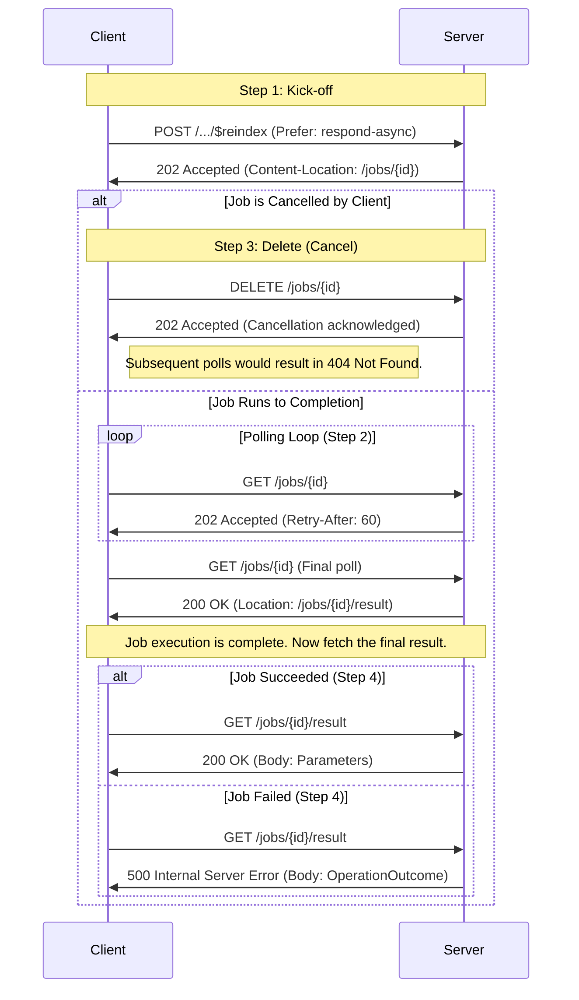

> The FHIR Asynchronous Interaction Request Pattern API is under active development. Participate in design discussions at [chat.fhir.org](https://chat.fhir.org/).


## Asynchronous Interaction Request Pattern

### Use Case

All interactions defined in the [RESTful API](http.html) are synchronous by default. For interactions that may require significant processing time, servers can offer an asynchronous mode so the client does not need to wait for a response.

This pattern, based on [RFC 7240](https://tools.ietf.org/html/rfc7240#section-4.1), applies to [Operations](operations.html) and [Defined Interactions](http.html) that a server elects to process asynchronously.

For example, an operation like `$reindex`, which might be used to process millions of `Observation` resources against a new `SearchParameter`, is an ideal candidate for this pattern. A synchronous request would likely time out, but an asynchronous request allows the client to submit the job and check on its status later. The final result of a successful `$reindex` operation is typically a `Parameters` resource summarizing the outcome.

#### Related Pattern: Asynchronous Bulk Data Request
For exporting bulk/large result sets (e.g., all `Patient` resources), see the [Asynchronous Bulk Data Request](async-bulk.html) pattern. When the `_outputFormat` parameter is present in a request, the Bulk Data pattern SHALL be used.

### Visual Overview: Sequence Diagram

This diagram shows the complete lifecycle of an asynchronous request, including the paths for a job that is cancelled versus one that runs to completion, and the outcomes for a completed job that either succeeds or fails.



---

### 1. Kick-off Request

The kick-off request uses the same HTTP method, URL, and body as the corresponding synchronous interaction, but adds a `Prefer` header to signal the asynchronous request.

#### Headers

*   **`Accept`** (string)
    *   Specifies the format for any `OperationOutcome` returned immediately at kick-off or for transient polling errors. A client SHOULD provide this header. If omitted, the server MAY choose a format or return an error.
*   **`Prefer`** (string, **required**)
    *   Must be set to `respond-async` to request asynchronous processing.

#### Example: Kicking off a `$reindex` Operation

Here, the client asks the server to re-index all `Observation` resources for a new search parameter.

```http
POST /fhir/Observation/$reindex HTTP/1.1
Host: fhir.example.com
Accept: application/fhir+json
Prefer: respond-async
Content-Type: application/fhir+json

{
  "resourceType": "Parameters",
  "parameter": [
    {
      "name": "url",
      "valueUrl": "http://example.org/fhir/SearchParameter/observation-special-code"
    }
  ]
}
```

#### Response - Success

If the server accepts the job, it returns `202 Accepted` with a `Content-Location` header pointing to a status polling URL.

*   **HTTP Status Code:** `202 Accepted`
*   **`Content-Location`:** An absolute URL for polling the job's status.
*   **Body (Optional):** An `OperationOutcome` with informational details.

#### Example: Server Response for `$reindex` Kick-off

```http
HTTP/1.1 202 Accepted
Content-Location: https://fhir.example.com/jobs/reindex-job-12345
Content-Type: application/fhir+json

{
  "resourceType": "OperationOutcome",
  "issue": [{
    "severity": "information",
    "code": "informational",
    "details": { "text": "Re-indexing job accepted and is now in progress." }
  }]
}
```

#### Response - Error

If the server rejects the request (e.g., due to invalid parameters or lack of permissions), it returns a standard `4XX` or `5XX` error.

*   **HTTP Status Code:** `4XX` or `5XX`
*   **Body:** An `OperationOutcome` explaining the error.

---

### 2. Status Request (Polling)

Clients poll the URL from the `Content-Location` header using an HTTP `GET` to check the job's status. Clients SHOULD implement an [exponential backoff](https://en.wikipedia.org/wiki/Exponential_backoff) strategy.

Servers SHOULD include a [`Retry-After`](https://developer.mozilla.org/en-US/docs/Web/HTTP/Headers/Retry-After) header (in seconds or as an HTTP-date) to guide the client's polling frequency. If a client polls too frequently, the server SHOULD return `429 Too Many Requests`.

#### Response - In Progress

While the job is still running, the server responds with `202 Accepted`.

*   **HTTP Status Code:** `202 Accepted`
*   **Headers:**
    *   `Retry-After`: (Optional) Suggests when to make the next request.
    *   `X-Progress`: (Optional) A short string describing the current progress (e.g., "55% complete").
*   **Body:** No body.

#### Example: In-Progress Poll for `$reindex`

```http
GET /jobs/reindex-job-12345 HTTP/1.1
Host: fhir.example.com
Accept: application/fhir+json
```

```http
HTTP/1.1 202 Accepted
Retry-After: 60
X-Progress: Indexed 550,000 of 1,200,000 resources.
```

#### Response - Complete

When the job is finished (whether it succeeded or failed), the server responds with `200 OK`. The `Location` header points to the final result.

*   **HTTP Status Code:** `200 OK`
*   **Headers:**
    *   `Location`: The absolute URL of the final result resource or endpoint.
*   **Body:** Body is empty. The final result must be fetched from the `Location` URL.

#### Example: Completed Poll for `$reindex`

```http
GET /jobs/reindex-job-12345 HTTP/1.1
Host: fhir.example.com
Accept: application/fhir+json
```

```http
HTTP/1.1 200 OK
Location: https://fhir.example.com/jobs/reindex-job-12345/result
```

---

### 3. Delete Request (Cancel)

The client MAY send an HTTP `DELETE` to the polling URL to request cancellation of the job. On success, the server SHOULD clean up any associated data. Subsequent polls to this URL MUST return `404 Not Found`.

#### Response - Success

*   **HTTP Status Code:** `202 Accepted`
*   **Body (Optional):** An `OperationOutcome`.

#### Example: Cancelling the `$reindex` Job

```http
DELETE /jobs/reindex-job-12345 HTTP/1.1
Host: fhir.example.com
```

```http
HTTP/1.1 202 Accepted
Content-Type: application/fhir+json

{
  "resourceType": "OperationOutcome",
  "issue": [{
    "severity": "information",
    "code": "informational",
    "details": { "text": "Job cancellation requested." }
  }]
}
```

---

### 4. Fetch the Result

After receiving a `200 OK` from the polling URL with a `Location` header, the client performs a final `GET` against that `Location` URL to retrieve the outcome of the operation.

The response from this final `GET` is **exactly what the synchronous interaction would have returned**. This includes the status code (e.g., `200 OK` for success, `422 Unprocessable Entity` for a business rule error), standard headers (`ETag`, `Last-Modified`), and the body (e.g., a `Parameters` resource for an operation, a resource for a create, a `Bundle` for a search).

#### Example: Fetching the Successful `$reindex` Result

The client fetches the result and receives the final `Parameters` resource indicating success.

```http
GET /jobs/reindex-job-12345/result HTTP/1.1
Host: fhir.example.com
Accept: application/fhir+json
```

```http
HTTP/1.1 200 OK
Content-Type: application/fhir+json; charset=utf-8

HTTP/1.1 200 OK
Content-Type: application/fhir+json; charset=utf-8
ETag: W/"job-12345-final"
Last-Modified: Fri, 01 Mar 2024 14:05:10 GMT

{
  "resourceType": "Parameters",
  "parameter": [
    {
      "name": "status",
      "valueCode": "completed"
    },
    {
      "name": "durationInSeconds",
      "valueDecimal": 742.5
    },
    {
      "name": "resourcesScanned",
      "valueUnsignedInt": 1200000
    },
    {
      "name": "indexEntriesCreated",
      "valueUnsignedInt": 1457890
    },
    {
      "name": "processingSummary",
      "part": [
        {
          "name": "resourcesIndexedSuccessfully",
          "valueUnsignedInt": 1198540
        },
        {
          "name": "resourcesSkippedNoMatchingPath",
          "valueUnsignedInt": 1458
        },
        {
          "name": "resourcesSkippedWithError",
          "valueUnsignedInt": 2
        }
      ]
    },
    {
      "name": "message",
      "valueString": "Re-indexing complete. 2 resources failed validation and were skipped."
    }
  ]
}
```

#### Example: Fetching a Failed `$reindex` Result

If the re-indexing job failed internally, the final result is an error. The polling status would still return `200 OK` (because the job has *completed*), but fetching the result reveals the failure.

```http
GET /jobs/reindex-job-12345/result HTTP/1.1
Host: fhir.example.com
Accept: application/fhir+json
```

```http
HTTP/1.1 500 Internal Server Error
Content-Type: application/fhir+json; charset=utf-8

{
  "resourceType": "OperationOutcome",
  "issue": [{
    "severity": "error",
    "code": "exception",
    "details": { "text": "Job failed due to an unexpected database connection error during indexing." }
  }]
}
```

1) What errors are synchronous vs. asynchronous?
- Minimal answer: Invalid input/auth -> 4XX/5XX immediately. Otherwise -> 202 async; runtime failures surface at result time.

2) How do clients know an operation supports async?
- Minimal answer: Clients send `Prefer: respond-async`. If unsupported, server returns 400. Operation Definitions can publish human-readable description stating that async executation is allowed or reqiured.
- Richer answer: define extensions on `OperationDefinition` to indicate async-behavior (allowed | required | ...)

