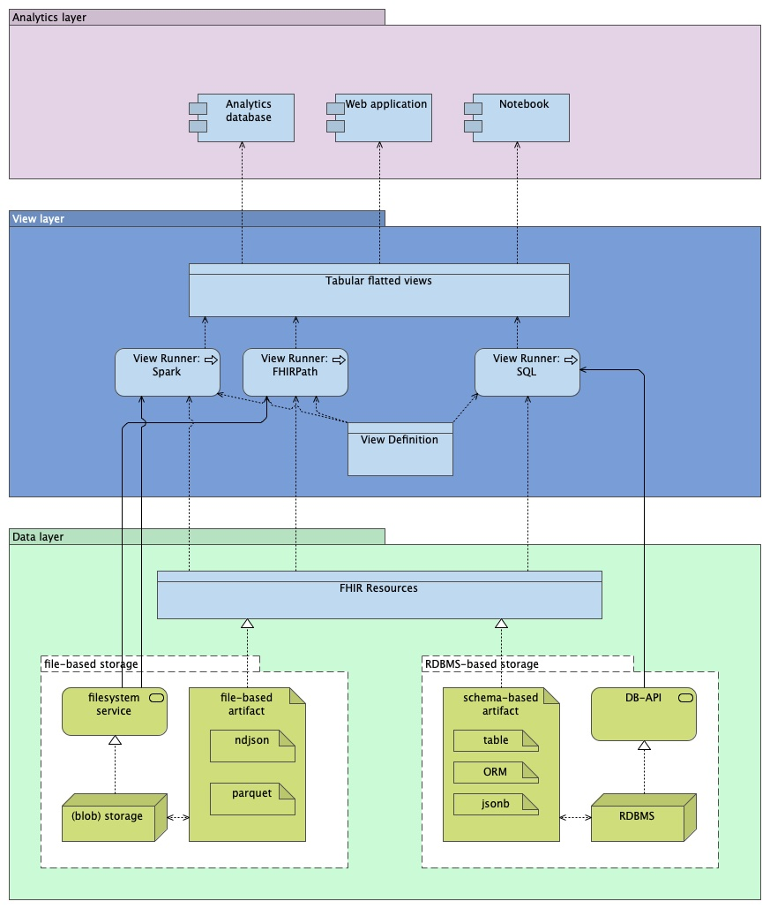

The system consists of three logical layers as shown in the diagram below:
the *Data Layer*, the *View Layer* and the *Analytics Layer*. This specification
focuses primarily upon the View layer. The Data and Analytics layers are optional,
and are provided as general patterns to assist with implementation.

**Figure 1: High-level diagram of layers**

### The Data Layer
The *Data Layer* is a set of lossless representations that collectively enable FHIR
to be used with a wide variety of different query technologies. It may
optionally be persisted and annotated to make it or implementations of the view
layer more efficient, but no specific Data Layer structure will be required by
this specification.

Implementations are encouraged but not required to further annotate the FHIR
resources to help View layer implementations run efficient queries. This
primarily applies when the underlying FHIR resources are stored in databases
that the View layer will query.

### The View Layer
The *View Layer* defines portable, tabular views of FHIR data that can more easily
be consumed by a wide variety of analytic tools. The use of these tools is
described in *Analytics Layer* section. Our goal here is simply to get
the needed FHIR data in a form that matches user needs and common analytic
patterns.

The View Layer itself has two key components:

* *View Definitions*, allowing users to define flattened views of FHIR data that
are portable between systems.
* *View Runners* are system-specific tools or libraries that apply view definitions to
the underlying data layer, optionally making use of annotation to optimze performance.

See the [View Definition documentation](StructureDefinition-ViewDefinition.html) for details and examples; 
these are the central piece of this specification.

View Runners will be specific to the data
layer they use. Each data layer may have one or more corresponding view
runners, but a given View Definition can be run by many runners over many
data layers.

Example view runners may include:

* A runner that creates a virtual, tabular view in an analytic database
* A runner that queries FHIR JSON directly and creates a table in a web application
* A runner that loads data directly into a notebook or other data analysis tool

### The Analytics Layer

Finally, users must be able to easily leverage the above views with the analytic
tools of their choice. This spec purposefully does not define what these are,
but common use cases may be SQL queries by consuming applications, dataframe-based
data science tools in Python or R, or integration with business intelligence tools.

### Examples

To clarify the intention and purpose of the specification, consider the [Archimate](https://pubs.opengroup.org/architecture/archimate32-doc/) 
layered viewpoint detailing the key Application elements (shown in blue) and Technology elements (green).
Examples of possible implementations are given here as guidance. 

**Figure 2: Detailed diagram of layers with examples**

#### File-based vs. RDBMS-based storage for the data layer

Implementers may choose from several options from the data layer, including but
not limited to:

* File-based, serverless storage using, for example, FHIR in NDJSON format on disk,
or FHIR in parquet format on disk;
* RDBMS-based (serverfull) storage using, for example, FHIR resources stored directly
as JSON in a database, or FHIR resources translated to a schematized structure within
a database, such as each FHIR field expanded into separate database columns for query efficiency.

Note that that for new technlogies, this distinction may be less evident or relevant.
For example, duckdb allow you to implement runners using SQL, whilst the duckdb runtime in fact
only needs a file-based storage system. Please refer to the [technology matrix](tech-matrix.html) for more details.

Depending on the the chosen storage technology, examples of annotation of the data layer
may include but are not limited to:

* Hashing resource IDs so they are evenly distributed, which can help some
database query engines.
* Adding native reference row IDs to FHIR References, so database engines can
efficiently join between resources.
* Expanding imprecise FHIR dates (e.g., those that have only a year) to
effectively be periods to simplify honoring date comparison semantics in the view layer.

#### FHIRPath runner on NDJSON

TO DO: explain how FHIRPath + ndjson works. Can FHIRPath run on jsonb?

#### Spark runner on NDJSON or parquet

TO DO: explain how spark runner works.

#### PostgreSQL runner

TO DO: explain how PostgreSQL runner works, with different storage versions within PostgreSQL (jsonb, relational)

#### Patterns for consumption of tabular views

TO DO:
- expain how views can be persisted (or are they intended to be generated on the fly at all times)?
- does specification only allow for tabular view on single FHIR Resources, or also tabular views that
combine different resources? For example, a `patient_timeline` table that includes all events (`encounter`, start of `EpisodeOfCare`, `Observation`)?

---

**[Next: View Definitions](StructureDefinition-ViewDefinition.html)**
