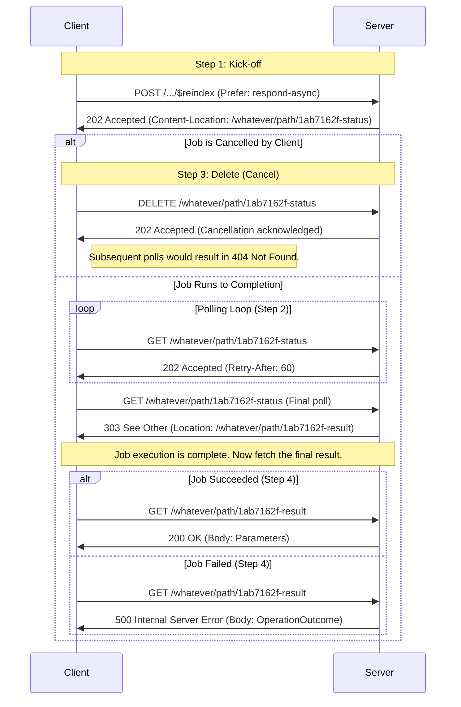

# Design: Unified Async Pattern for FHIR Operations

## Context

This change aligns `$viewdefinition-export` with the simplified FHIR async pattern proposed by Josh Mandel.

**References**:
- Josh's proposal: https://hackmd.io/@jmandel/async-pattern-simplified
- Diagrams source: https://hackmd.io/XjbZwitlQyaA3_0SkQR2pQ

## Async Pattern Diagram (from Josh)

This diagram illustrates the complete lifecycle including cancellation paths and outcomes for successful/failed completions.

## Background from Meetings

### SQL on FHIR Working Group Meeting (Jan 13, 2026)

> * Nikolai and Josh scheduling meeting this week (Thursday or Friday) to discuss async pattern alignment across specifications
> * Priority work items identified for current release:
>   * Query resource page needs development
>   * Materialized/continuous export operation needs design
>   * Bulk synchronous report operation needs design

### Josh Mandel / Nikolai Ryzhikov / Steve Munini Alignment Meeting (Jan 15, 2026)

**Key Decision**: Nikolai and Steve agreed to adopt Josh's redirect-only async completion pattern (`303 See Other`) instead of allowing inline results (`200 OK`).

**Convincing Arguments from Josh**:

1. **Error Ambiguity**:
   > "If 500 error occurs during polling, is it a polling failure or operation failure?"

   The redirect pattern cleanly separates these: polling errors are protocol-level, operation errors are communicated via the result endpoint.

2. **Header Scope Ambiguity**:
   > "If client sends 'Accept: JSON' header, does it apply to status response or final result?"

   The redirect pattern solves this by allowing different parameters for status requests vs. result requests. Nikolai acknowledged this gives flexibility to introduce different status formats (like JSON-LD) in future without mixing concerns.

3. **Error Handling Clarification**:
   > "If operation fails completely, communicate via successful polling (result is ready) followed by error status code on result endpoint"

   Operations like export can have partial success (500,000 items succeed, one fails) which should be communicated within operation semantics, not protocol-level errors.

**Response Body During Polling**:
- Josh adjusted draft specification based on Nikolai's feedback to allow response bodies during polling
- Polling responses can contain operation outcomes or other content with implementation-defined semantics
- Agreement that this will be extension territory for now, not core specification

**Interim/Partial Results During Polling** (agreed with Josh and Steve):
- Polling responses (`202 Accepted`) MAY contain partial/interim results in the response body
- This allows servers to report progress details beyond just `X-Progress` header
- Response body format during polling is implementation-defined for now
- Future work: Introduce extension mechanism for marking parameters as "interim" vs "final" in OperationDefinition

**Future Considerations** (not in this change):
- FHIR Task integration: Add header or output parameter with task ID for job discovery
- Interim parameters extension: Formalize which output parameters can appear in polling responses

## Goals / Non-Goals

### Goals
- Adopt redirect-only pattern (`303 See Other`) for async completion
- Cleanly separate polling semantics from result semantics
- Align with emerging FHIR async pattern direction
- Resolve error and header scope ambiguities

### Non-Goals
- FHIR Task integration (future work)
- Legacy mode parameter support (future work)
- Changes to kick-off request format
- Changes to `$viewdefinition-run` operation

## Decisions

### Decision: Use 303 See Other for completion
**What**: When async operation completes, status endpoint returns `303 See Other` with `Location` header pointing to result URL.

**Why**:
- Cleanly separates polling from result retrieval
- Eliminates error ambiguity (500 during polling vs 500 from operation)
- Eliminates header scope ambiguity (Accept applies to status vs result)
- Result response is identical to synchronous call

**Alternatives considered**:
- `200 OK` with results in body (current pattern) - rejected due to ambiguities
- `302 Found` - not semantically correct for this use case
- `307 Temporary Redirect` - preserves method, not appropriate

### Decision: Errors communicated via result endpoint
**What**: Even if operation fails, polling returns `303`, then result endpoint returns error status.

**Why**:
- Polling errors (network, server issues) clearly distinguished from operation errors
- Partial success scenarios handled within operation semantics
- Consistent pattern regardless of success/failure

### Decision: Allow interim status in polling body
**What**: `202 Accepted` responses MAY contain OperationOutcome or interim status.

**Why**:
- Provides flexibility for implementations
- Not strictly required by core spec
- Extension territory for now

## Risks / Trade-offs

| Risk | Mitigation |
|------|------------|
| Two endpoints instead of one | Cleaner semantics outweigh minor complexity |

Note: The current async spec is not yet published, so no migration concerns or breaking changes.

## Implementation Plan

1. Update specification documentation
2. Update reference implementation (sof-js)

## Open Questions

- None currently - spec is pre-release so we can adopt the cleaner pattern directly.
